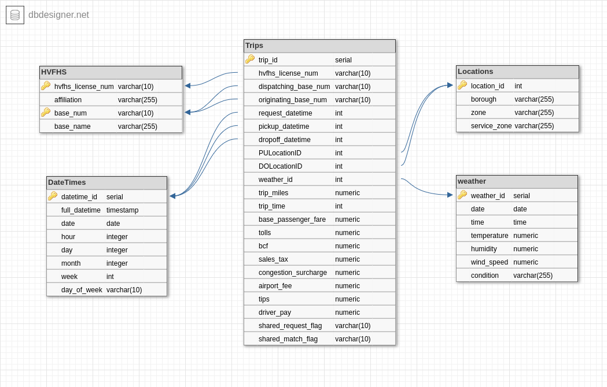

# New York City Taxi and Limousine Commission Data Lake Project

This project extracts data from the New York City Taxi and Limousine Commission's (TLC) trip record data and weather data scraped from https://www.wunderground.com/. 
The TLC data provides information on taxi and for-hire vehicle trips in New York City, including pickup and dropoff times and locations, fares, and payment types. The wunderground data provides information on weather conditions in New York City, including temperature, precipitation, and wind speed.

The end use case for this data is to create an analytics data lake that can be used to analyze the relationship between weather conditions and taxi, Lyft and Uber etc. trips in New York City.

## Data Model

The extracted data is transformed and loaded into a star schema that is based on the TLC Trip Record Data and weather data. The star schema allows for a variety of analytical queries to gain insights into the for-hire vehicle industry in New York City.

### Schema contain one fact table and four Dimension Tables:

  

## ETL Pipeline

The ETL pipeline consists of three main stages:

-  Stage 1: Extraction
The first stage involves extracting the data from two sources: the TLC trip record data and the weather data scraped from https://www.wunderground.com/.

  - Stage 2: Transformation
The second stage involves cleaning and transforming the extracted data to create the star schema. 

  - Stage 3: Loading
The final stage involves loading the transformed data into the star schema. The data is written to the following parquet files:

    - trip/trips_table.parquet
    - hvl/hvl_table.parquet
    - time/datetime_table.parquet
    - location/location_table.parquet
    - weather/weather_table.parquet 

   - The main tools used in this project are:
      - Spark : Apache Spark is used because the dataset is quite large, and processing it on a single machine would be time-consuming and impractical. Spark's distributed architecture allows it to break up the dataset into smaller partitions and process them in parallel across a cluster of machines, making it possible to process large datasets quickly.
      - AWS EMR: we use Apache Spark on AWS EMR to process large amounts of trip data and extract meaningful insights. EMR provides an easy-to-use interface for launching and managing Spark clusters, and it takes care of the underlying infrastructure setup, including provisioning and configuring the required compute resources.

      - AWS S3: All the data that needs to be processed is first loaded into S3, and then processed using Spark on EMR. The processed data is then stored back in S3. S3 is a cost-effective and scalable solution for storing large amounts of data, making it an ideal choice for building data lakes. Additionally, S3 provides a high level of durability and availability, making it a reliable choice for storing critical data. 

  - The frequency of data updates:
    - The frequency of data updates depends on the specific use case and business needs. In general, it's important to keep the data as up-to-date as possible to ensure that the insights derived from the data are relevant and accurate.
    - In this project, I would recommend updating the data on a monthly basis to ensure that the most recent trips are included in the analysis based on that TLC provides data in a monthly manner. 

## Running the ETL Pipeline
To run the ETL pipeline, follow these steps:

Set up the AWS_ACCESS_KEY_ID and AWS_SECRET_ACCESS_KEY environment variables.
Run the etl.py script to execute the pipeline

## Other Scenarios

- Airflow could be incorporated into this project to manage the ETL workflows and automate the data pipeline processes.

- I chose a star data model for this project because it allows for easy querying and analysis of the data. If the data was increased by 100x, I would consider using a distributed computing system, such as AWS EMR, to handle the increased data volume.

- If the pipelines were run on a daily basis by 7am, I would use Airflow to schedule and automate the ETL workflows.

- If the database needed to be accessed by 100+ people, I would consider using a cloud-based solution, such as Amazon Redshift or Google BigQuery, to ensure scalability and availability. I would also implement security measures, such as role-based access control

## Structure of the project

    ├── docs                                # Contains files about data model and ETL pipeline.
    ├── hvfhs-data-lake                     # The folder where the processed data is stored.
    ├── data                                # The folder where the raw data is stored.
    ├── utils                               # Contains files with functions used in the ETL pipeline.
    ├── data_exploration.ipynb              # Jupyter notebook used for data exploration.
    ├── analysis.ipynb                      # Jupyter notebook used for some data analysis.
    ├── dl.cfg                              # The credentials and config used to manage the AWS resources.
    ├── etl.py                              # Code for the ETL pipeline.
    ├── README.md